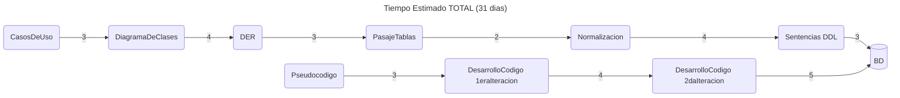

#Diagrama de PERT

```mermaid
---
title: Tiempo Estimado TOTAL (31 dias)
---
graph LR;

      ordersDB[(BD)];
1(CasosDeUso)--->|3|2;
2(DiagramaDeClases)--->|4|3;
3(DER)--->|3|4;
4(PasajeTablas)--->|2|5;
5(Normalizacion)--->|4|6;
6(Sentencias DDL)-->|3|ordersDB;
7(Pseudocodigo)--->|3|8;
8(DesarrolloCodigo 1eraIteracion)--->|4|9;
9(DesarrolloCodigo 2daIteracion)--->|5|ordersDB;

```
